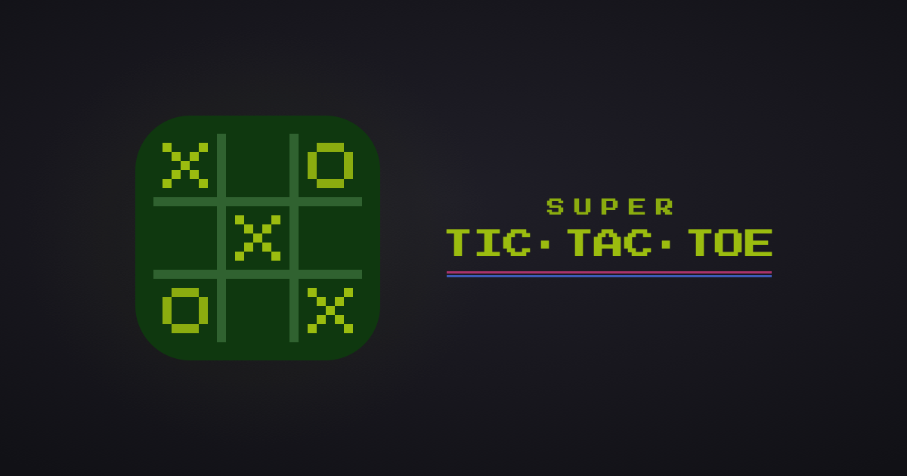

# Super Tic-Tac-Toe

[](https://github.com/akdevv/super-tic-tac-toe/actions/workflows/ci.yml)



Nine games of tic-tac-toe on one board, styled like an old handheld console. Play on one screen, against the CPU, or online through a link.

**Play: [super-tic-tac-toe-gamma.vercel.app](https://super-tic-tac-toe-gamma.vercel.app)**

## How to play

- Win three small boards in a row to win the game.
- The cell you pick sends your opponent to the matching board.
- Three in a row wins a small board. A full board with no line counts for nobody.
- Sent to a closed board? Play in any open one.

## Features

- CPU with three levels, using Monte Carlo tree search in a web worker.
- Online play with no account. Database rules check every turn, so nobody can cheat.
- Installable, and local and CPU games work offline.
- Chiptune sounds, phone vibration, keyboard and screen reader support.

| Key    | Keyboard      | Does          |
| ------ | ------------- | ------------- |
| D-pad  | Arrow keys    | Move          |
| A      | Enter / Space | Place, select |
| B      | Backspace     | Undo, back    |
| START  | Esc           | Pause         |
| SELECT | H             | How to play   |
|        | M             | Mute          |

## Development

Needs Node 24, pnpm 10, and Java 21+ for the Firebase emulator.

```sh
pnpm install
pnpm emulators   # terminal 1
pnpm dev         # terminal 2
```

With no Firebase config, dev uses the local emulator. Open an invite link in an incognito window to play yourself online.

| Script            | Does                                             |
| ----------------- | ------------------------------------------------ |
| `pnpm build`      | Type-check and build                             |
| `pnpm test`       | Unit tests                                       |
| `pnpm test:rules` | Database rules tests (emulator running)          |
| `pnpm test:e2e`   | Playwright: games, menus, offline, accessibility |
| `pnpm lint`       | ESLint                                           |
| `pnpm format`     | Prettier                                         |
| `pnpm icons`      | Redraw favicon, app icons, OG image (macOS)      |

CI runs lint, format, all three test suites and the build on every push.

## How online play works

Games live at `games/{id}` in Firebase Realtime Database, and the link is the only way in. Players sign in anonymously. The rules in `database.rules.json` enforce seats, turn order, rematch scores and the 60-second disconnect forfeit. When the last player leaves, their browser deletes the game.

## Deploying

1. Create a Firebase project with Realtime Database (locked mode), Anonymous sign-in and a Web app.
2. Copy `.env.example` to `.env.local` and fill in the web app config.
3. Deploy the rules, and again whenever `database.rules.json` changes:
   ```sh
   pnpm dlx firebase-tools deploy --only database --project <project-id>
   ```
4. Import the repo on Vercel and add the same env vars. `vercel.json` handles routing and security headers.

**Optional App Check:** create a reCAPTCHA v3 key, add its secret in Firebase App Check, and set `VITE_FIREBASE_APPCHECK_KEY` to the site key. Enforce it only after the live site shows verified traffic.

## Project structure

```
src/
  pages/      routes
  device/     console shell and keys
  screen/     board, sprites, logo, overlays
  menus/      menus and their screens
  feedback/   sound and vibration
  game/       game rules and CPU, no React
  online/     Firebase
tests/        unit, rules, e2e
scripts/      logo asset generator
```

## Credits

Fonts: [Press Start 2P](https://fonts.google.com/specimen/Press+Start+2P) and [Saira](https://fonts.google.com/specimen/Saira) (OFL). Vibration: [web-haptics](https://github.com/lochie/web-haptics). Made by [akdevv](https://github.com/akdevv). [MIT](LICENSE) licensed.
